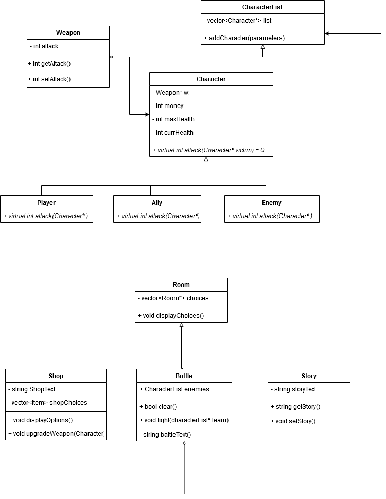

# Lost Souls
 Authors:  
 > Ryan Chang, https://github.com/ryanchangx  
 > Min-Chen Wu, https://github.com/jwu2759  
 > Karan Bhogal, https://github.com/karanpanman
 
## Project Description
Our project will be a story-driven RPG with linear progression. We want to have a compelling story relying on understandable motives and the weight of one’s decisions. We plan to have a party (each with unique classes) consisting of the main protagonist (intended to be the player), along with multiple trusted allies. Throughout the course of the game, the main party will have to fight foes and ultimately reach a final destination.
* Games have always been a key part of our lives, ever since we were children. They provide a healthy challenge, inspiring stories, and a lot of fun. Even though they were simple RPGs, games like Final Fantasy and Pokemon have defined many childhoods across the world. This topic is important to us due to the sheer impact they have on people.
* The language we will use for the project is C++, we plan to use GDB, and valgrind to debug our code, and Git and GitHub for version control. 
* The input we will be using for this project is user inputs (the player can type the names of the Protagonist and allies, along with picking actions in battle such as attacking). Outputs include displaying character and combat stats (damage/health), and outputing dialogue and story to the user.
  * Factory Pattern: To create the weapon class, and support different kinds of weapons, we will be using a factory pattern to return weapons of different types. This will be used with the creation of weapons for the player, ally, and enemy classes. Using a factory will simplify the interface for creating weapons for an unknown number of enemies and characters.
  * Composite Pattern: We picked the Composite Pattern and we will implement a room system using this pattern. At a very simple level, each room should be able to store the address/pointer to the next room, and the contents inside of it: the room structure will follow a recursive composition. An issue we anticipate will happen is memory leaks with the destructor; the number of rooms needed is unknown at runtime, and thus properly freeing the memory may prove to be a difficult task. The composite pattern should lead to a good solution to the room system as this system allows for the limitless composition of many rooms; this simplifies access to the next/previous room thus increasing efficiency and allowing for easier debugging of any code written for this structure. 
<!--
 > ## Phase II
 > In addition to completing the "Class Diagram" section below, you will need to 
 > * Set up your GitHub project board as a Kanban board for the project. It should have columns that map roughly to 
 >   * Backlog, TODO, In progress, In testing, Done
 >   * You can change these or add more if you'd like, but we should be able to identify at least these.
 > * There is no requirement for automation in the project board but feel free to explore those options.
 > * Create an "Epic" (note) for each feature and each design pattern and assign them to the appropriate team member. Place these in the `Backlog` column
 > * Complete your first *sprint planning* meeting to plan out the next 7 days of work.
 >   * Create smaller development tasks as issues and assign them to team members. Place these in the `Backlog` column.
 >   * These cards should represent roughly 7 days worth of development time for your team, taking you until your first meeting with the TA
-->
## Class Diagram
<!--
 > Include a class diagram(s) for each design pattern and a description of the diagram(s). Your class diagram(s) should include all the main classes you plan for the project. This should be in sufficient detail that another group could pick up the project this point and successfully complete it. Use proper OMT notation (as discussed in the course slides). You may combine multiple design patterns into one diagram if you'd like, but it needs to be clear which portion of the diagram represents which design pattern (either in the diagram or in the description). 
-->

 
 > ## Phase III
 > You will need to schedule a check-in with the TA (during lab hours or office hours). Your entire team must be present. 
 > * Before the meeting you should perform a sprint plan like you did in Phase II
 > * In the meeting with your TA you will discuss: 
 >   - How effective your last sprint was (each member should talk about what they did)
 >   - Any tasks that did not get completed last sprint, and how you took them into consideration for this sprint
 >   - Any bugs you've identified and created issues for during the sprint. Do you plan on fixing them in the next sprint or are they lower priority?
 >   - What tasks you are planning for this next sprint.

 > ## Final deliverable
 > All group members will give a demo to the TA during lab time. The TA will check the demo and the project GitHub repository and ask a few questions to all the team members. 
 > Before the demo, you should do the following:
 > * Complete the sections below (i.e. Screenshots, Installation/Usage, Testing)
 > * Plan one more sprint (that you will not necessarily complete before the end of the quarter). Your In-progress and In-testing columns should be empty (you are not doing more work currently) but your TODO column should have a full sprint plan in it as you have done before. This should include any known bugs (there should be some) or new features you would like to add. These should appear as issues/cards on your Kanban board. 
 
 ## Screenshots
  Screenshots of the input/output after running your application
 * The game initializes asking for user input regarding the character names:
 
 
 ## Installation/Usage
 > Instructions on installing and running your application
 ## Testing
 > How was your project tested/validated? If you used CI, you should have a "build passing" badge in this README.
 
